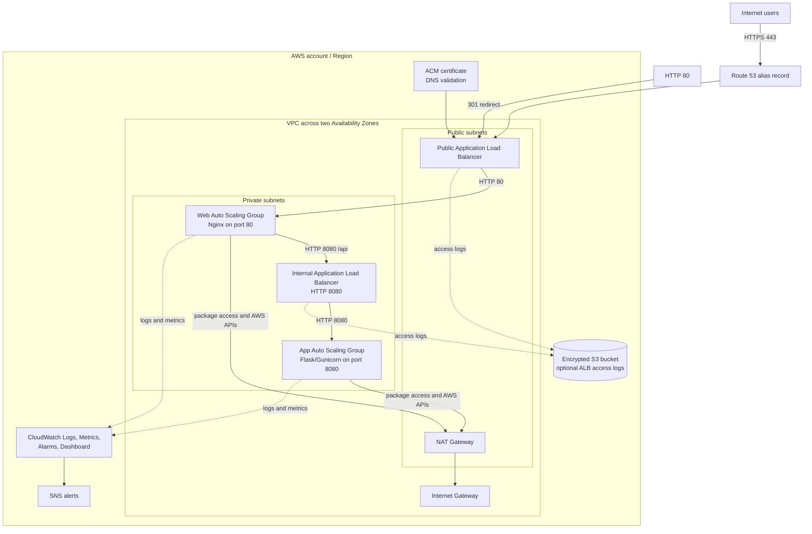
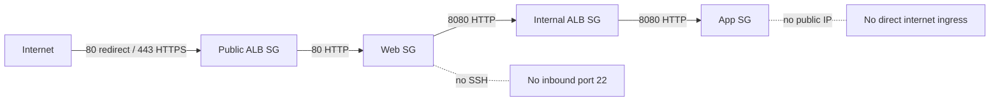
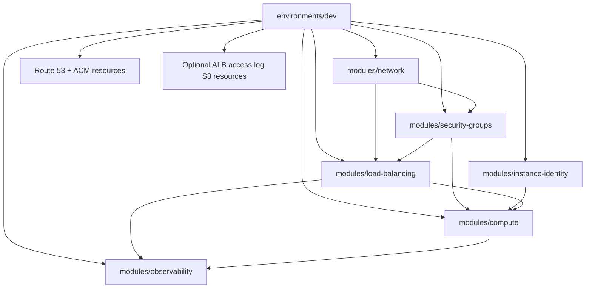

# Terraform AWS Secure Two-Tier VPC

This Terraform AWS Secure Two-Tier VPC portfolio project builds a production-style dev environment for a two-tier application on AWS using Terraform for Infrastructure-as-Code (IaC). This project emphasizes private compute, least-privilege network paths, managed access to project resources through AWS Systems Manager, load-balanced traffic, secure HTTPS communication at the edge, centralized observability, and Auto Scaling Groups for resiliency and self-healing capacity.

The motivation behind this project was to create a project as a demonstration of my skills based on concepts learned through passing the AWS Solutions Architect Associates (AWS SAA) exam. These concepts include the use of Infrastructure-as-Code to provide a versioned, repeatable infrastructure, AWS networking, and a security-focused design. 

## Architecture



```text
Internet
  |
  | HTTPS
  v
Public Application Load Balancer
  |
  | HTTP :80
  v
Private Web Auto Scaling Group
  |
  | HTTP :8080
  v
Internal Application Load Balancer
  |
  | HTTP :8080
  v
Private Application Auto Scaling Group
```

Supporting components:

- VPC spanning two Availability Zones
- Public subnets for load balancers and NAT
- Private subnets for web and application instances
- Route 53 alias record for the application hostname
- ACM certificate with DNS validation
- IAM instance profile for AWS Systems Manager access
- NAT gateway for private instance bootstrap and package access
- CloudWatch log groups, metrics, alarms, dashboard, and optional SNS email notifications
- Optional encrypted S3 bucket for public and internal ALB access logs
- Security groups using source security group references instead of broad private CIDR rules

## Security Flow



## Module Composition



## What This Demonstrates

- Modular Terraform design with reusable `network`, `security-groups`, `load-balancing`, `compute`, and `instance-identity` modules
- Centralized observability with a reusable `observability` module
- Multi-AZ AWS network layout with public and private subnet tiers
- Internet-facing and internal Application Load Balancers
- HTTPS listener with HTTP-to-HTTPS redirect
- Route 53 DNS integration and ACM DNS certificate validation
- Private EC2 instances with no public IPv4 addresses
- Launch Templates and Auto Scaling Groups for web and app tiers
- ALB target group health checks and automatic replacement of unhealthy instances
- CloudWatch log groups, instance metrics, alarms, dashboard, and SNS alerting
- Optional encrypted S3 ALB access logs with lifecycle retention
- IMDSv2 enforcement and encrypted `gp3` root volumes
- Systems Manager-ready instance identity without SSH keys
- Nginx reverse proxy from the web tier to the internal app endpoint

## Security Notes

The public ALB is the only internet-facing application entry point. Web and application instances are launched in private subnets and do not receive public IPv4 addresses.

Security group flow is intentionally narrow:

- Public ALB accepts inbound HTTP/HTTPS from the internet.
- Web tier accepts HTTP only from the public ALB security group.
- Internal ALB accepts application traffic only from the web security group.
- App tier accepts application traffic only from the internal ALB security group.

Instance hardening includes:

- IMDSv2 required
- Instance metadata tags disabled
- Encrypted root volumes
- No SSH key pair
- Systems Manager access through an IAM instance profile

## Repository Layout

```text
.
|-- environments/
|   `-- dev/
|       |-- alb-access-logs.tf
|       |-- main.tf
|       |-- variables.tf
|       |-- outputs.tf
|       |-- provider.tf
|       |-- versions.tf
|       `-- dev.tfvars.example
|-- modules/
|   |-- compute/
|   |-- instance-identity/
|   |-- load-balancing/
|   |-- network/
|   |-- observability/
|   `-- security-groups/
```

The Terraform root module is `environments/dev`. Reusable infrastructure code lives under `modules/`.

## How To Review The Project

The most useful files to inspect first are:

- `environments/dev/main.tf` for the full environment composition
- `modules/network/main.tf` for VPC, subnet, NAT, and routing design
- `modules/security-groups/main.tf` for the network access model
- `modules/load-balancing/main.tf` for public and internal ALB configuration
- `modules/compute/main.tf` for Launch Templates and Auto Scaling Groups
- `modules/compute/templates/` for the web and application bootstrap scripts
- `modules/observability/main.tf` for CloudWatch logs, metrics, alarms, dashboard, and SNS
- `environments/dev/alb-access-logs.tf` for optional encrypted ALB access log storage

## Running It Yourself

Prerequisites:

- Terraform `1.16.2`
- AWS CLI credentials for an account where you can create VPC, EC2, IAM, ALB, ACM, and Route 53 resources
- A Route 53 hosted zone if you want to deploy HTTPS and DNS

From the Terraform root:

```bash
cd environments/dev
terraform init
terraform fmt -recursive
terraform validate
```

Create a local variables file:

```bash
cp dev.tfvars.example dev.tfvars
```

Update `dev.tfvars` with your own domain and Route 53 hosted zone ID:

```hcl
domain_name    = "app.example.com"
hosted_zone_id = "REPLACE_WITH_ROUTE53_HOSTED_ZONE_ID"
alarm_email    = null
```

Then plan and apply:

```bash
terraform plan -var-file="dev.tfvars" -out=tfplan
terraform apply tfplan
```

Do not commit `dev.tfvars`, `tfplan`, `.terraform/`, or Terraform state files. They are intentionally ignored.

## Validation

After deployment, verify the application path:

```bash
curl -I http://app.example.com
curl --fail https://app.example.com/health
curl --fail https://app.example.com/api/
```

Expected behavior:

- HTTP redirects to HTTPS.
- `/health` returns a web-tier health response.
- `/api/` returns a JSON response from the private application tier.

You can also terminate one ASG-managed web or app instance and confirm that the Auto Scaling Group launches a replacement that becomes healthy in the appropriate target group.

For observability, confirm that CloudWatch log streams appear for the web and app instances, review the generated CloudWatch dashboard, and confirm the SNS subscription if `alarm_email` is configured.

## Cost And Cleanup

This project creates billable AWS resources, including Application Load Balancers, NAT Gateway, EC2 instances, Route 53 records, and public IPv4-related resources. Destroy the environment when you are finished testing:

```bash
terraform destroy -var-file="dev.tfvars"
```

## Public Repo Hygiene

This repository is designed to be public-safe:

- No Terraform state files are committed.
- No plan files are committed.
- No real `*.tfvars` files are committed.
- The example variables file uses placeholders for account-specific DNS values.
