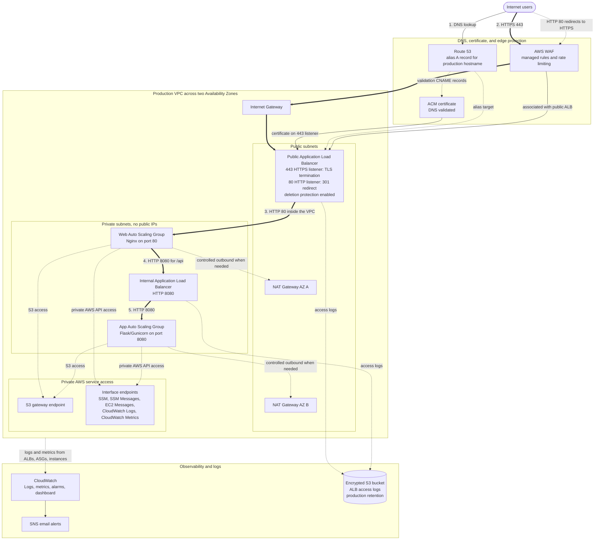
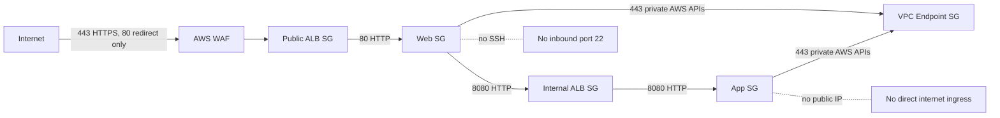
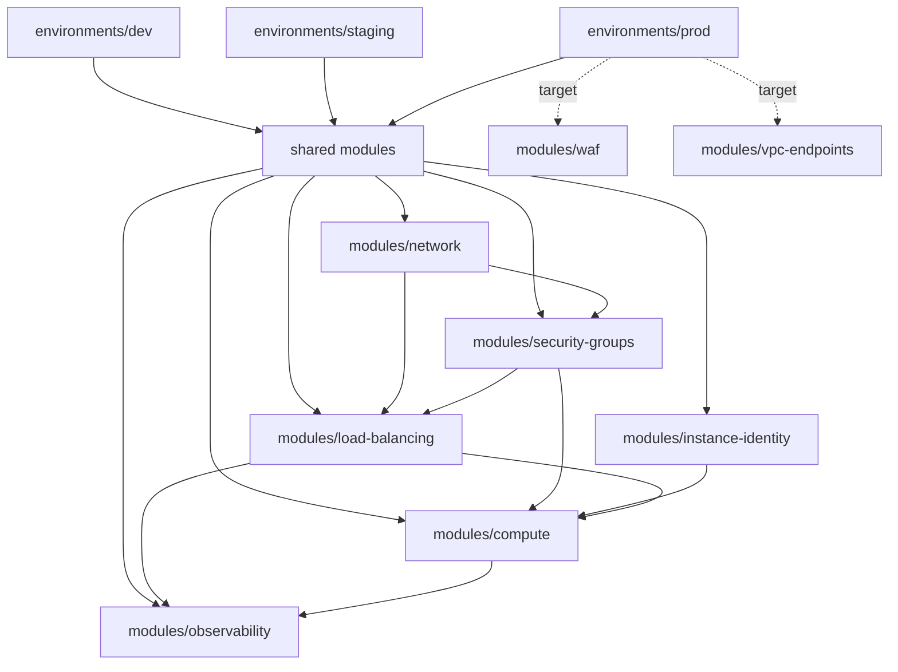

# Terraform AWS Secure Two-Tier VPC

This Terraform AWS Secure Two-Tier VPC portfolio project demonstrates a secure, multi-environment AWS application platform using Infrastructure-as-Code. It starts with a cost-conscious dev environment, promotes through staging, and is designed toward a more resilient production environment with stronger availability, observability, and edge protection.

The motivation behind this project was to build a hands-on demonstration of concepts learned through the AWS Solutions Architect Associate exam: versioned infrastructure, VPC design, private compute, load-balanced application tiers, operational visibility, least-privilege network paths, and environment promotion.

## Environment Model

```text
dev -> staging -> production
```

- `dev` is optimized for lower-cost iteration and learning.
- `staging` is production-like validation with separate naming, CIDR, DNS, state, and configurable networking behavior.
- `prod` is the target production root for the most resilient version of the architecture.

Each environment is a separate Terraform root module under `environments/` and reuses the shared modules under `modules/`.

## Target Production Architecture

This diagram represents the intended production architecture for the project. Environment-specific READMEs describe what each root module currently deploys.

Numbered edges show the application request path. Thick lines carry application traffic, dotted lines represent DNS, certificate validation, telemetry, control plane, and private AWS service access.



```text
Internet
  |
  | HTTPS :443  (HTTP :80 is redirected to HTTPS)
  v
AWS WAF
  |
  v
Public Application Load Balancer  (TLS terminates here, ACM certificate)
  |
  | HTTP :80  (inside the VPC)
  v
Private Web Auto Scaling Group
  |
  | HTTP :8080
  v
Internal Application Load Balancer
  |
  | HTTP :8080
  v
Private Application Auto Scaling Group
```

Production-oriented supporting components:

- Separate Terraform state and environment-specific naming
- VPC spanning two Availability Zones
- Public subnets for load balancers and NAT gateways
- Private subnets for web and application instances
- One NAT Gateway per Availability Zone for production resilience
- VPC endpoints for Systems Manager, CloudWatch, and S3 access from private subnets
- Route 53 alias record for the production hostname
- ACM certificate with DNS validation
- AWS WAF associated with the public ALB
- IAM instance profile for AWS Systems Manager access
- CloudWatch log groups, metrics, alarms, dashboard, and SNS email notifications
- Encrypted S3 bucket for public and internal ALB access logs
- Security groups using source security group references instead of broad private CIDR rules

## Security Flow



The public ALB is the only internet-facing application entry point. Web and application instances are launched in private subnets and do not receive public IPv4 addresses.

Instance hardening includes:

- IMDSv2 required
- Instance metadata tags disabled
- Encrypted root volumes
- No SSH key pair
- Systems Manager access through an IAM instance profile

## Module Composition



## What This Demonstrates

- Modular Terraform design with reusable environment roots
- Multi-environment promotion from dev to staging to production
- Configurable NAT Gateway strategy for cost versus availability
- Centralized observability with a reusable `observability` module
- Multi-AZ AWS network layout with public and private subnet tiers
- Internet-facing and internal Application Load Balancers
- HTTPS listener with ACM certificate and HTTP-to-HTTPS redirect
- Route 53 DNS integration and ACM DNS certificate validation
- Private EC2 instances with no public IPv4 addresses
- Launch Templates and Auto Scaling Groups for web and app tiers
- ALB target group health checks and automatic replacement of unhealthy instances
- CloudWatch log groups, instance metrics, alarms, dashboard, and SNS alerting
- Encrypted S3 ALB access logs with lifecycle retention
- IMDSv2 enforcement and encrypted `gp3` root volumes
- Systems Manager-ready instance identity without SSH keys
- Nginx reverse proxy from the web tier to the internal app endpoint

## Repository Layout

```text
.
|-- environments/
|   |-- dev/
|   |   |-- README.md
|   |   |-- alb-access-logs.tf
|   |   |-- main.tf
|   |   |-- variables.tf
|   |   |-- outputs.tf
|   |   |-- provider.tf
|   |   |-- versions.tf
|   |   `-- dev.tfvars.example
|   |-- staging/
|   |   |-- README.md
|   |   |-- main.tf
|   |   |-- variables.tf
|   |   |-- outputs.tf
|   |   |-- provider.tf
|   |   |-- versions.tf
|   |   `-- staging.tfvars.example
|   `-- prod/
|       `-- README.md
|-- modules/
|   |-- compute/
|   |-- instance-identity/
|   |-- load-balancing/
|   |-- network/
|   |-- observability/
|   `-- security-groups/
```

Reusable infrastructure code lives under `modules/`. Environment roots live under `environments/`.

## How To Review The Project

Start with:

- `environments/dev/README.md` for the current dev environment
- `environments/staging/README.md` for the current staging environment
- `environments/staging/main.tf` for the staging root module
- `environments/prod/README.md` for the production target notes
- `modules/network/main.tf` for VPC, subnet, NAT, and routing design
- `modules/security-groups/main.tf` for the network access model
- `modules/load-balancing/main.tf` for public and internal ALB configuration
- `modules/compute/main.tf` for Launch Templates and Auto Scaling Groups
- `modules/compute/templates/` for the web and application bootstrap scripts
- `modules/observability/main.tf` for CloudWatch logs, metrics, alarms, dashboard, and SNS

## Running Environments

Run Terraform from the environment root you intend to deploy:

```bash
cd environments/dev
terraform init
terraform fmt -recursive
terraform validate
terraform plan -var-file="dev.tfvars" -out=tfplan
```

For staging:

```bash
cd environments/staging
terraform init
terraform validate
terraform plan -var-file="staging.tfvars" -out=tfplan
```

Do not commit real `*.tfvars`, `tfplan`, `.terraform/`, or Terraform state files. They are intentionally ignored.

## Validation

After deployment, verify the application path for the environment hostname:

```bash
curl -I http://app.example.com
curl --fail https://app.example.com/health
curl --fail https://app.example.com/api/
```

Expected behavior:

- `http://` returns `301 Moved Permanently` with a `Location: https://...` header.
- `/health` returns a web-tier health response.
- `/api/` returns a JSON response from the private application tier.

You can also terminate one ASG-managed web or app instance and confirm that the Auto Scaling Group launches a replacement that becomes healthy in the appropriate target group.

For observability, confirm that CloudWatch log streams appear for the web and app instances, review the generated CloudWatch dashboard, and confirm the SNS subscription if `alarm_email` is configured.

## Cost And Cleanup

This project creates billable AWS resources, including Application Load Balancers, NAT Gateways, EC2 instances, Route 53 records, CloudWatch resources, S3 storage, and public IPv4-related resources.

Destroy only from the environment root you intend to remove:

```bash
terraform destroy -var-file="dev.tfvars"
```

Use extra caution with staging and production state. Production should use isolated remote state, deletion protection where appropriate, and deliberate review before destroy.

## Public Repo Hygiene

This repository is designed to be public-safe:

- No Terraform state files are committed.
- No plan files are committed.
- No real `*.tfvars` files are committed.
- Example variables files use placeholders for account-specific DNS values.
