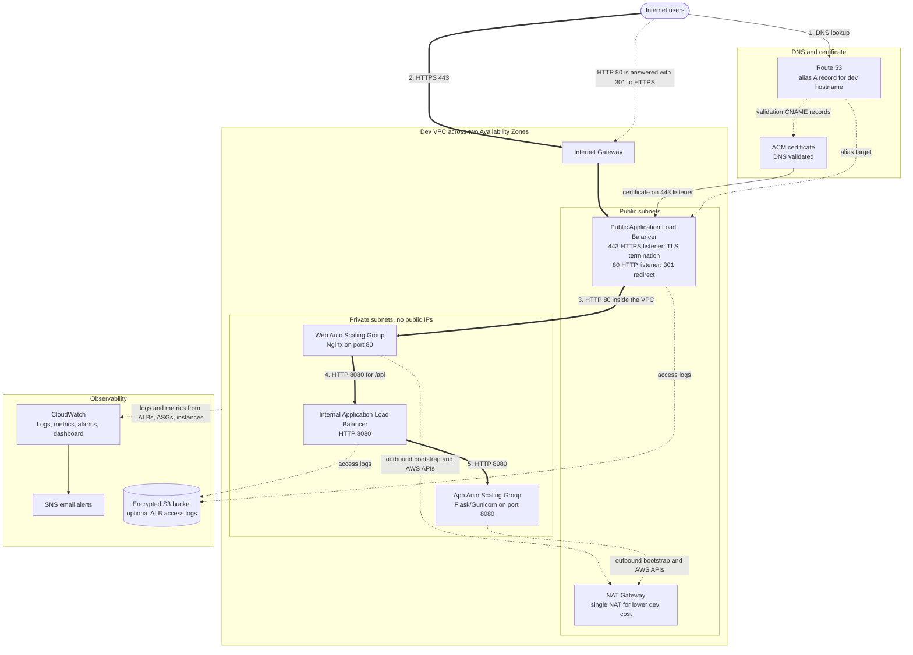
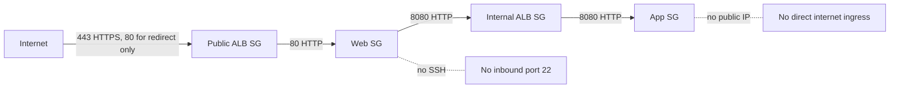

# Dev Environment

This Terraform root deploys the development version of the Secure Two-Tier VPC architecture. It is intentionally close to the production shape, but it keeps cost and iteration speed in mind.

## Architecture

Numbered edges show the request path. Thick lines carry application traffic, dotted lines are control plane, DNS, and telemetry. TLS terminates at the public ALB; everything behind it is plain HTTP on private subnets.



```text
Internet
  |
  | HTTPS :443  (HTTP :80 is 301-redirected to HTTPS :443)
  v
Public Application Load Balancer  (TLS terminates here, ACM certificate)
  |
  | HTTP :80  (inside the VPC)
  v
Private Web Auto Scaling Group
  |
  | HTTP :8080
  v
Internal Application Load Balancer
  |
  | HTTP :8080
  v
Private Application Auto Scaling Group
```

## Dev Characteristics

- Default VPC CIDR: `10.0.0.0/16`
- One public and one private subnet per Availability Zone
- One NAT Gateway by default: `nat_gateway_mode = "single"`
- Public and internal Application Load Balancers
- Private web and app Auto Scaling Groups
- Route 53 alias record and ACM DNS validation
- CloudWatch logs, metrics, alarms, dashboard, and optional SNS email subscription
- Optional encrypted S3 bucket for ALB access logs
- No WAF module in the dev root by default
- No VPC endpoint module in the dev root by default

## Security Flow



## Running Dev

From this directory:

```bash
terraform init
terraform fmt -recursive
terraform validate
terraform plan -var-file="dev.tfvars" -out=tfplan
terraform apply tfplan
```

Create `dev.tfvars` from the example file:

```bash
cp dev.tfvars.example dev.tfvars
```

Set environment-specific values:

```hcl
domain_name      = "dev.example.com"
hosted_zone_id   = "REPLACE_WITH_ROUTE53_HOSTED_ZONE_ID"
alarm_email      = null
nat_gateway_mode = "single"
```

Do not commit `dev.tfvars`, `tfplan`, `.terraform/`, or Terraform state files.

## Validation

After deployment:

```bash
curl -I http://dev.example.com
curl --fail https://dev.example.com/health
curl --fail https://dev.example.com/api/
```

Expected behavior:

- HTTP redirects to HTTPS.
- `/health` responds from the web tier.
- `/api/` responds from the private application tier.

## Cleanup

Destroy from this directory only when you intend to remove dev:

```bash
terraform destroy -var-file="dev.tfvars"
```
