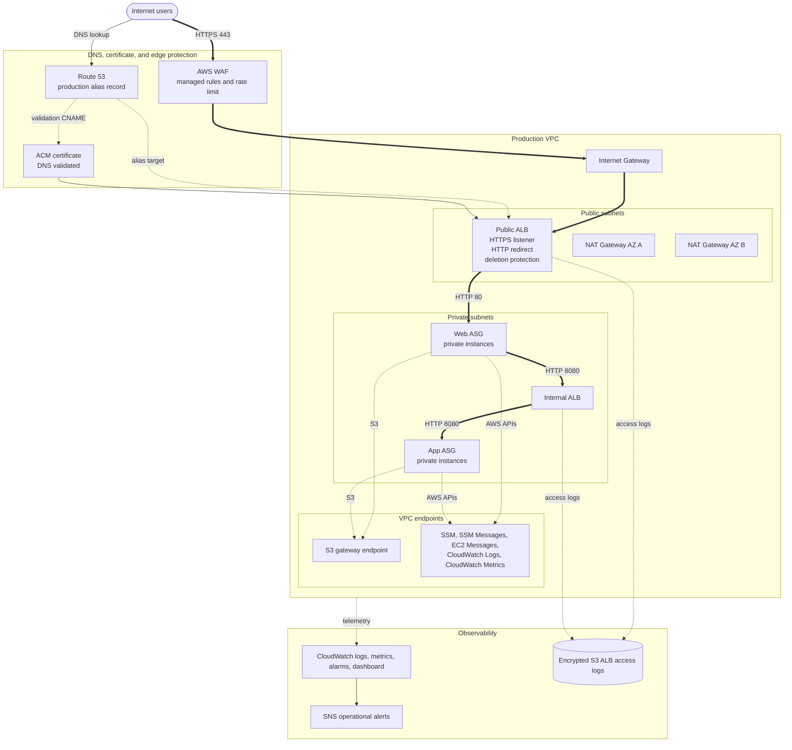

# Production Environment

This directory is reserved for the production Terraform root. The production environment should represent the most resilient and operationally safe version of the Secure Two-Tier VPC project.

The root project README shows the target production architecture. This README records the production-specific expectations so the implementation can stay aligned as the `prod` root is built out.

## Target Architecture



## Production Expectations

- Separate Terraform state from dev and staging
- Production-specific VPC CIDR, DNS name, and tags
- One NAT Gateway per Availability Zone
- VPC endpoints for private access to SSM, CloudWatch, and S3
- ALB deletion protection enabled
- AWS WAF associated with the public ALB
- WAF managed rules tested in count mode before blocking
- Production log retention and encrypted ALB access log storage
- Real SNS notification path
- No inbound SSH rule or EC2 key pair dependency
- Private web and app instances with no public IP addresses
- IMDSv2 required and encrypted root volumes

## Suggested Production Values

```hcl
aws_region         = "us-east-1"
vpc_cidr           = "10.40.0.0/16"
availability_zones = ["us-east-1a", "us-east-1b"]
nat_gateway_mode   = "per_az"
instance_type      = "t3.small"
app_port           = 8080

domain_name    = "app.example.com"
hosted_zone_id = "REPLACE_WITH_ROUTE53_HOSTED_ZONE_ID"

alarm_email = "REPLACE_WITH_PRODUCTION_ALERT_EMAIL"

enable_alb_access_logs         = true
alb_access_logs_retention_days = 365
```

## Production Readiness Checklist

- [ ] Production backend key/account/region verified before init or apply
- [ ] Production state is isolated from dev and staging
- [ ] Plan contains no dev or staging resource names
- [ ] Production VPC CIDR does not overlap other environments
- [ ] NAT Gateway mode is `per_az`
- [ ] ALB deletion protection is enabled
- [ ] WAF is associated only with the public ALB
- [ ] WAF rules have been observed in count mode before blocking
- [ ] Systems Manager works without public IPs or SSH
- [ ] CloudWatch logs and metrics arrive
- [ ] ALB access logs arrive in encrypted S3 storage
- [ ] SNS subscription is confirmed
- [ ] `/health` and `/api/` succeed over HTTPS

## Cleanup

Production destroy should be a deliberate, reviewed operation. Deletion protection and any `prevent_destroy` settings should block accidental removal until intentionally changed.
