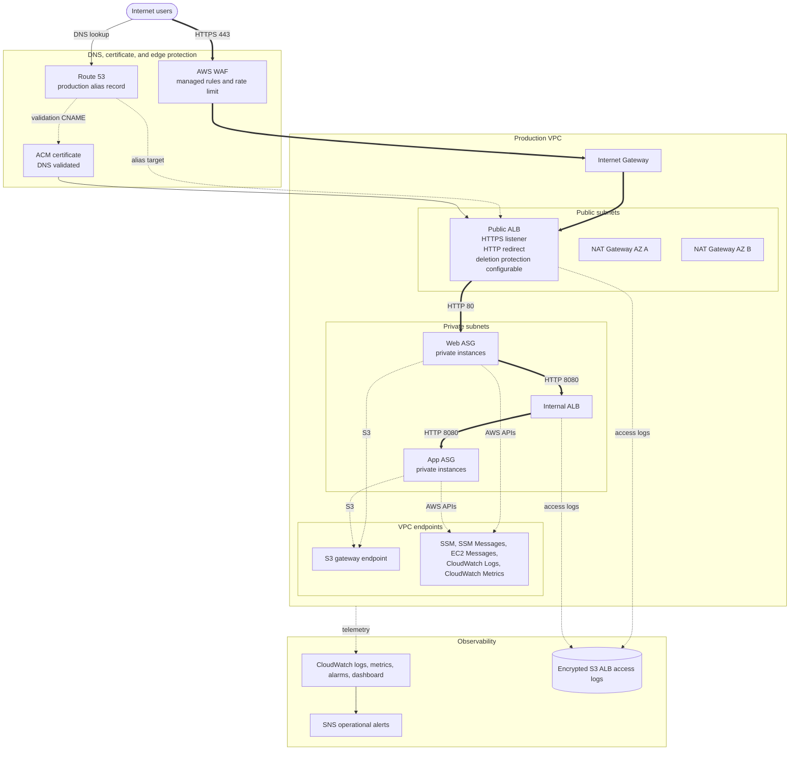

# Production Environment

This Terraform root deploys the production-shaped version of the Secure Two-Tier VPC project. It includes the resilient and security-focused controls planned for production, while keeping a few teardown-friendly defaults because this repository is used as a demo project.

The root project README shows the overall target architecture. This README records how the production environment is currently implemented.

## Architecture



## Production Characteristics

- Separate Terraform state from dev and staging
- Production-specific VPC CIDR, DNS name, and tags
- One NAT Gateway per Availability Zone
- VPC endpoints for private access to SSM, CloudWatch, and S3
- ALB deletion protection is configurable, but disabled in the sample values for demo cleanup
- AWS WAF associated with the public ALB
- WAF managed rules run in count mode by default before blocking
- Production log retention and encrypted ALB access log storage
- Real SNS notification path
- No inbound SSH rule or EC2 key pair dependency
- Private web and app instances with no public IP addresses
- IMDSv2 required and encrypted root volumes

## Suggested Production Values

```hcl
aws_region         = "us-east-1"
vpc_cidr           = "10.40.0.0/16"
availability_zones = ["us-east-1a", "us-east-1b"]
nat_gateway_mode   = "per_az"
instance_type      = "t3.micro"
app_port           = 8080

domain_name    = "app.example.com"
hosted_zone_id = "REPLACE_WITH_ROUTE53_HOSTED_ZONE_ID"

alarm_email = "REPLACE_WITH_PRODUCTION_ALERT_EMAIL"

enable_alb_access_logs         = true
alb_access_logs_retention_days = 365
enable_vpc_endpoints           = true
enable_alb_deletion_protection = false
enable_waf                     = true
waf_rate_limit                 = 2000
waf_managed_rules_count_mode   = true
```

For this demo project, `enable_alb_deletion_protection` is intentionally set to `false` so `terraform destroy` can clean up the environment without first changing the ALB settings. For a long-lived production deployment, set it to `true`.

The committed sample uses `t3.micro` to keep demo costs low. Use `t3.small` or larger for a more realistic long-lived production deployment.

## Production Readiness Checklist

- [ ] Production backend key/account/region verified before init or apply, if remote state is configured
- [ ] Production state is isolated from dev and staging
- [ ] Plan contains no dev or staging resource names
- [ ] Production VPC CIDR does not overlap other environments
- [ ] NAT Gateway mode is `per_az`
- [ ] ALB deletion protection is intentionally configured for the deployment mode
- [ ] WAF is associated only with the public ALB
- [ ] WAF rules have been observed in count mode before blocking
- [ ] Systems Manager works without public IPs or SSH
- [ ] CloudWatch logs and metrics arrive
- [ ] ALB access logs arrive in encrypted S3 storage
- [ ] SNS subscription is confirmed
- [ ] `/health` and `/api/` succeed over HTTPS

## Cleanup

Production destroy should be a deliberate, reviewed operation. This demo environment keeps ALB deletion protection disabled by default so resources can be cleaned up easily. For a long-lived production deployment, enable deletion protection and add any additional destroy safeguards required by your operating model.
