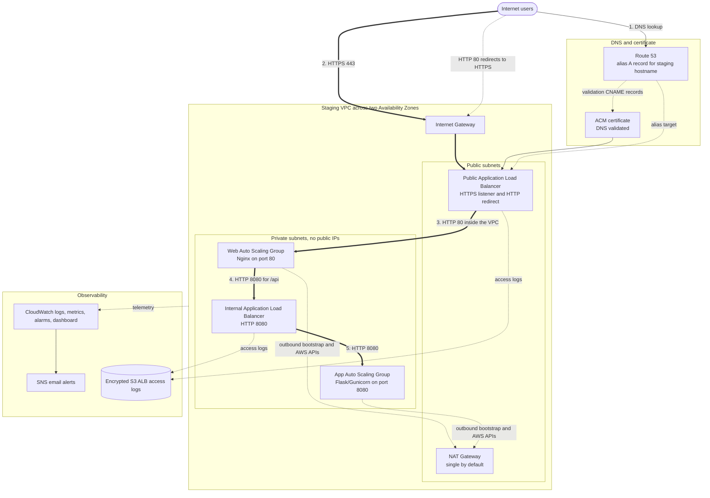

# Staging Environment

This Terraform root deploys the staging version of the Secure Two-Tier VPC architecture. Staging is intended to validate changes before production while remaining cost-aware during development.

At the moment, staging uses the same core architecture as dev with separate environment identity, a separate CIDR range, separate DNS values, and an explicit NAT Gateway mode setting.

## Architecture



## Staging Characteristics

- Default VPC CIDR: `10.20.0.0/16`
- Resource prefix: `secure-two-tier-staging`
- Environment tag: `staging`
- NAT Gateway mode is explicit and currently expected to be `single`
- Public and internal Application Load Balancers
- Private web and app Auto Scaling Groups
- Route 53 alias record and ACM DNS validation
- CloudWatch logs, metrics, alarms, dashboard, and SNS email notification
- Encrypted S3 bucket for ALB access logs

## Running Staging

From this directory:

```bash
terraform init
terraform validate
terraform plan -var-file="staging.tfvars" -out=tfplan
terraform apply tfplan
```

Create `staging.tfvars` from the example file:

```bash
cp staging.tfvars.example staging.tfvars
```

Set environment-specific values:

```hcl
vpc_cidr         = "10.20.0.0/16"
domain_name      = "staging.example.com"
hosted_zone_id   = "REPLACE_WITH_ROUTE53_HOSTED_ZONE_ID"
alarm_email      = "REPLACE_WITH_TEST_ALERT_EMAIL"
nat_gateway_mode = "single"
```

Do not commit `staging.tfvars`, `tfplan`, `.terraform/`, or Terraform state files.

## Validation

After deployment:

```bash
curl -I http://staging.example.com
curl --fail https://staging.example.com/health
curl --fail https://staging.example.com/api/
```

Expected behavior:

- HTTP redirects to HTTPS.
- `/health` responds from the web tier.
- `/api/` responds from the private application tier.

## Cleanup

Destroy from this directory only when you intend to remove staging:

```bash
terraform destroy -var-file="staging.tfvars"
```
